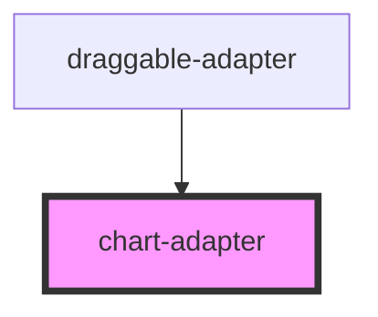

# chart-adapter

<!-- Auto Generated Below -->

## Properties

| Property         | Attribute | Description | Type               | Default     |
| ---------------- | --------- | ----------- | ------------------ | ----------- |
| `comDataApiData` | --        |             | `DraggableApiData` | `undefined` |
| `comDataConfig`  | --        |             | `DraggableConfig`  | `undefined` |
| `comDataView`    | --        |             | `DraggableView`    | `undefined` |
| `dataSource`     | --        |             | `any[]`            | `undefined` |

## Dependencies

### Used by

 - [draggable-adapter](../draggable-adapter)

### Graph

----------------------------------------------

*Built with [StencilJS](https://stenciljs.com/)*
