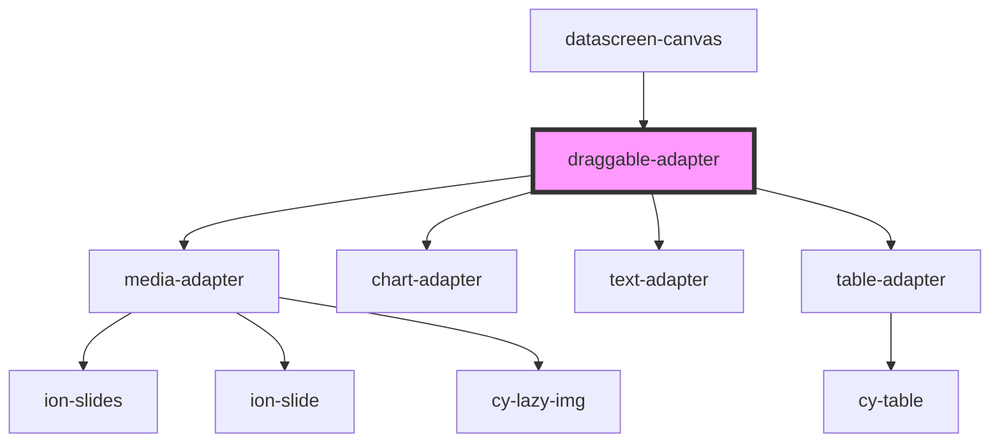

# draggable-adapter

<!-- Auto Generated Below -->

## Properties

| Property        | Attribute    | Description | Type      | Default     |
| --------------- | ------------ | ----------- | --------- | ----------- |
| `canModify`     | `can-modify` |             | `boolean` | `false`     |
| `comOptionData` | --           |             | `ComData` | `undefined` |

## Events

| Event   | Description | Type               |
| ------- | ----------- | ------------------ |
| `alert` |             | `CustomEvent<any>` |
| `toast` |             | `CustomEvent<any>` |

## Dependencies

### Used by

 - [datascreen-canvas](../../components/datascreen-canvas)

### Depends on

- [media-adapter](../media-adapter)
- [chart-adapter](../chart-adapter)
- [text-adapter](../text-adapter)
- [table-adapter](../table-adapter)

### Graph

----------------------------------------------

*Built with [StencilJS](https://stenciljs.com/)*
