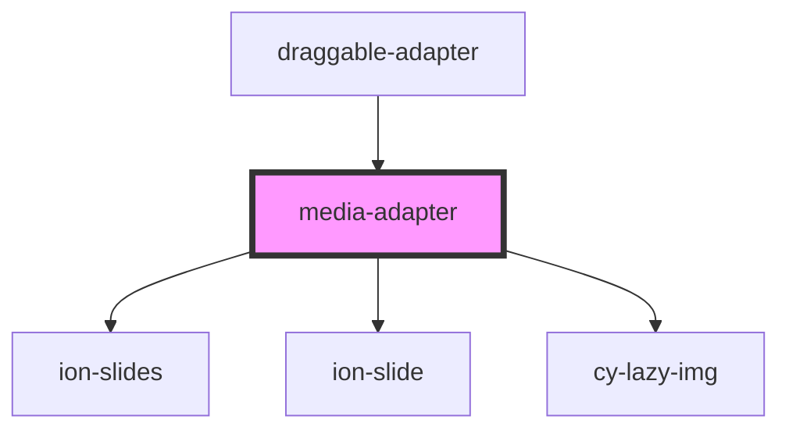

# media-adapter

<!-- Auto Generated Below -->

## Properties

| Property     | Attribute     | Description | Type      | Default     |
| ------------ | ------------- | ----------- | --------- | ----------- |
| `canModify`  | `can-modify`  |             | `boolean` | `false`     |
| `comData`    | --            |             | `ComData` | `undefined` |
| `dataSource` | `data-source` |             | `any`     | `undefined` |

## Dependencies

### Used by

 - [draggable-adapter](../draggable-adapter)

### Depends on

- ion-slides
- ion-slide
- [cy-lazy-img](../../components/cy-lazy-img)

### Graph

----------------------------------------------

*Built with [StencilJS](https://stenciljs.com/)*
