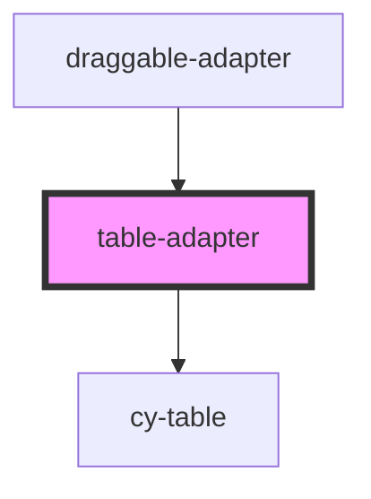

# table-adapter

<!-- Auto Generated Below -->

## Properties

| Property        | Attribute     | Description | Type              | Default     |
| --------------- | ------------- | ----------- | ----------------- | ----------- |
| `comDataConfig` | --            |             | `DraggableConfig` | `undefined` |
| `comDataView`   | --            |             | `DraggableView`   | `undefined` |
| `dataSource`    | `data-source` |             | `any`             | `undefined` |

## Dependencies

### Used by

 - [draggable-adapter](../draggable-adapter)

### Depends on

- [cy-table](../../components/cy-table)

### Graph

----------------------------------------------

*Built with [StencilJS](https://stenciljs.com/)*
