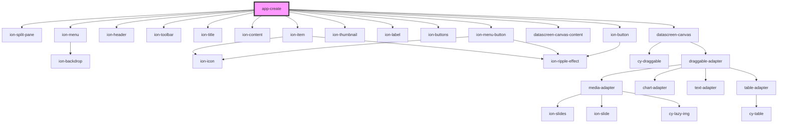

# app-create

<!-- Auto Generated Below -->

## Properties

| Property  | Attribute | Description | Type            | Default     |
| --------- | --------- | ----------- | --------------- | ----------- |
| `history` | --        |             | `RouterHistory` | `undefined` |

## Events

| Event   | Description | Type               |
| ------- | ----------- | ------------------ |
| `alert` |             | `CustomEvent<any>` |
| `toast` |             | `CustomEvent<any>` |

## Dependencies

### Depends on

- ion-split-pane
- ion-menu
- ion-header
- ion-toolbar
- ion-title
- ion-content
- ion-item
- ion-thumbnail
- ion-label
- ion-buttons
- ion-menu-button
- [datascreen-canvas-content](../datascreen-canvas-content)
- [datascreen-canvas](../datascreen-canvas)
- ion-button

### Graph

----------------------------------------------

*Built with [StencilJS](https://stenciljs.com/)*
