# app-home

<!-- Auto Generated Below -->

## Properties

| Property  | Attribute | Description | Type            | Default     |
| --------- | --------- | ----------- | --------------- | ----------- |
| `history` | --        |             | `RouterHistory` | `undefined` |
| `match`   | --        |             | `MatchResults`  | `undefined` |

## Events

| Event   | Description | Type               |
| ------- | ----------- | ------------------ |
| `alert` |             | `CustomEvent<any>` |
| `toast` |             | `CustomEvent<any>` |

## Dependencies

### Depends on

- [datascreen-header](../datascreen-header)
- [datascreen-layer-panel](../datascreen-layer-panel)
- [datascreen-com-panel](../datascreen-com-panel)
- [datascreen-edit-main](../datascreen-edit-main)
- [datascreen-setting-panel](../datascreen-setting-panel)

### Graph

```mermaid
graph TD;
  app-home --> datascreen-header
  app-home --> datascreen-layer-panel
  app-home --> datascreen-com-panel
  app-home --> datascreen-edit-main
  app-home --> datascreen-setting-panel
  datascreen-header --> ion-header
  datascreen-header --> ion-toolbar
  datascreen-header --> ion-buttons
  datascreen-header --> ion-button
  datascreen-header --> ion-icon
  datascreen-header --> ion-title
  ion-button --> ion-ripple-effect
  datascreen-layer-panel --> cy-fast-click
  datascreen-layer-panel --> ion-item
  datascreen-layer-panel --> ion-thumbnail
  datascreen-layer-panel --> cy-iconfont
  datascreen-layer-panel --> ion-label
  datascreen-layer-panel --> ion-header
  datascreen-layer-panel --> ion-toolbar
  datascreen-layer-panel --> ion-title
  datascreen-layer-panel --> ion-buttons
  datascreen-layer-panel --> ion-button
  datascreen-layer-panel --> ion-icon
  datascreen-layer-panel --> ion-content
  datascreen-layer-panel --> ion-reorder-group
  datascreen-layer-panel --> ion-reorder
  ion-item --> ion-icon
  ion-item --> ion-ripple-effect
  ion-reorder --> ion-icon
  datascreen-com-panel --> ion-header
  datascreen-com-panel --> ion-toolbar
  datascreen-com-panel --> ion-title
  datascreen-com-panel --> ion-buttons
  datascreen-com-panel --> ion-button
  datascreen-com-panel --> ion-icon
  datascreen-com-panel --> ion-content
  datascreen-com-panel --> ion-segment
  datascreen-com-panel --> ion-segment-button
  datascreen-com-panel --> cy-iconfont
  ion-segment-button --> ion-ripple-effect
  datascreen-edit-main --> datascreen-canvas-content
  datascreen-edit-main --> datascreen-canvas
  datascreen-edit-main --> ion-button
  datascreen-edit-main --> ion-label
  datascreen-edit-main --> ion-range
  datascreen-edit-main --> ion-icon
  datascreen-canvas --> cy-draggable
  datascreen-canvas --> draggable-adapter
  draggable-adapter --> media-adapter
  draggable-adapter --> chart-adapter
  draggable-adapter --> text-adapter
  draggable-adapter --> table-adapter
  media-adapter --> ion-slides
  media-adapter --> ion-slide
  media-adapter --> cy-lazy-img
  table-adapter --> cy-table
  datascreen-setting-panel --> ion-button
  datascreen-setting-panel --> setting-canvas-option
  datascreen-setting-panel --> ion-header
  datascreen-setting-panel --> ion-segment
  datascreen-setting-panel --> ion-segment-button
  datascreen-setting-panel --> ion-icon
  datascreen-setting-panel --> ion-toolbar
  datascreen-setting-panel --> ion-title
  datascreen-setting-panel --> ion-content
  datascreen-setting-panel --> setting-common-config
  datascreen-setting-panel --> ion-grid
  datascreen-setting-panel --> ion-row
  datascreen-setting-panel --> ion-col
  datascreen-setting-panel --> ion-input
  datascreen-setting-panel --> cy-lazy-img
  datascreen-setting-panel --> cy-item-extend
  datascreen-setting-panel --> ion-toggle
  datascreen-setting-panel --> ion-select
  datascreen-setting-panel --> ion-select-option
  datascreen-setting-panel --> cy-table
  datascreen-setting-panel --> setting-chart-series
  datascreen-setting-panel --> setting-data-config
  setting-canvas-option --> ion-header
  setting-canvas-option --> ion-toolbar
  setting-canvas-option --> ion-title
  setting-canvas-option --> ion-content
  setting-canvas-option --> ion-grid
  setting-canvas-option --> ion-row
  setting-canvas-option --> ion-col
  setting-canvas-option --> ion-input
  setting-canvas-option --> ion-img
  setting-canvas-option --> ion-button
  setting-common-config --> ion-grid
  setting-common-config --> ion-row
  setting-common-config --> ion-col
  setting-common-config --> ion-input
  setting-common-config --> ion-range
  cy-item-extend --> ion-list
  cy-item-extend --> ion-item
  cy-item-extend --> ion-label
  cy-item-extend --> ion-icon
  cy-item-extend --> ion-item-group
  setting-chart-series --> ion-row
  setting-chart-series --> ion-col
  setting-chart-series --> ion-button
  setting-chart-series --> ion-segment
  setting-chart-series --> ion-segment-button
  setting-chart-series --> ion-label
  setting-chart-series --> ion-list
  setting-chart-series --> ion-input
  setting-chart-series --> cy-item-extend
  setting-chart-series --> ion-select
  setting-chart-series --> ion-select-option
  setting-chart-series --> ion-toggle
  setting-data-config --> ion-input
  setting-data-config --> ion-row
  setting-data-config --> ion-col
  setting-data-config --> ion-select
  setting-data-config --> ion-select-option
  setting-data-config --> cy-table
  setting-data-config --> ion-textarea
  setting-data-config --> ion-note
  setting-data-config --> cy-item-extend
  setting-data-config --> ion-toggle
  setting-data-config --> ion-button
  style app-home fill:#f9f,stroke:#333,stroke-width:4px
```

----------------------------------------------

*Built with [StencilJS](https://stenciljs.com/)*
