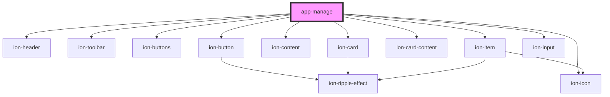

# app-manage

<!-- Auto Generated Below -->

## Properties

| Property  | Attribute | Description | Type            | Default     |
| --------- | --------- | ----------- | --------------- | ----------- |
| `history` | --        |             | `RouterHistory` | `undefined` |

## Events

| Event     | Description | Type               |
| --------- | ----------- | ------------------ |
| `alert`   |             | `CustomEvent<any>` |
| `popover` |             | `CustomEvent<any>` |

## Dependencies

### Depends on

- ion-header
- ion-toolbar
- ion-buttons
- ion-button
- ion-icon
- ion-content
- ion-card
- ion-card-content
- ion-item
- ion-input

### Graph

----------------------------------------------

*Built with [StencilJS](https://stenciljs.com/)*
