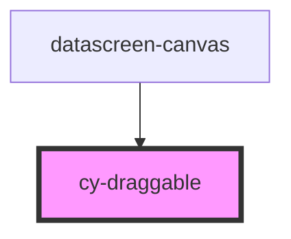

# cy-draggable

<!-- Auto Generated Below -->

## Properties

| Property    | Attribute    | Description | Type      | Default |
| ----------- | ------------ | ----------- | --------- | ------- |
| `canModify` | `can-modify` |             | `boolean` | `false` |
| `isChoose`  | `is-choose`  |             | `boolean` | `false` |
| `scale`     | `scale`      |             | `number`  | `1`     |

## Events

| Event     | Description | Type               |
| --------- | ----------- | ------------------ |
| `choose`  |             | `CustomEvent<any>` |
| `cyDrag`  |             | `CustomEvent<any>` |
| `cyScale` |             | `CustomEvent<any>` |

## Dependencies

### Used by

 - [datascreen-canvas](../datascreen-canvas)

### Graph

----------------------------------------------

*Built with [StencilJS](https://stenciljs.com/)*
