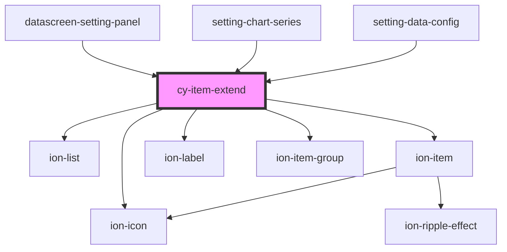

# cy-item-extend

<!-- Auto Generated Below -->

## Properties

| Property       | Attribute       | Description | Type               | Default |
| -------------- | --------------- | ----------- | ------------------ | ------- |
| `header`       | `header`        |             | `string`           | `""`    |
| `iconPosition` | `icon-position` |             | `"end" \| "start"` | `"end"` |

## Dependencies

### Used by

 - [datascreen-setting-panel](../datascreen-setting-panel)
 - [setting-chart-series](../setting-chart-series)
 - [setting-data-config](../setting-data-config)

### Depends on

- ion-list
- ion-item
- ion-label
- ion-icon
- ion-item-group

### Graph

----------------------------------------------

*Built with [StencilJS](https://stenciljs.com/)*
