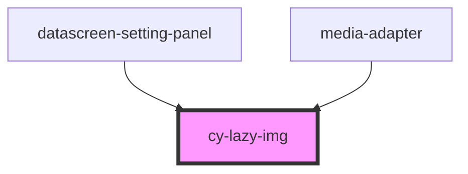

# cy-lazy-img

<!-- Auto Generated Below -->

## Properties

| Property     | Attribute     | Description | Type      | Default |
| ------------ | ------------- | ----------- | --------- | ------- |
| `alt`        | `alt`         |             | `string`  | `""`    |
| `defaultImg` | `default-img` |             | `string`  | `""`    |
| `isLazy`     | `is-lazy`     |             | `boolean` | `true`  |
| `src`        | `src`         |             | `string`  | `""`    |

## Dependencies

### Used by

 - [datascreen-setting-panel](../datascreen-setting-panel)
 - [media-adapter](../../adapter/media-adapter)

### Graph

----------------------------------------------

*Built with [StencilJS](https://stenciljs.com/)*
