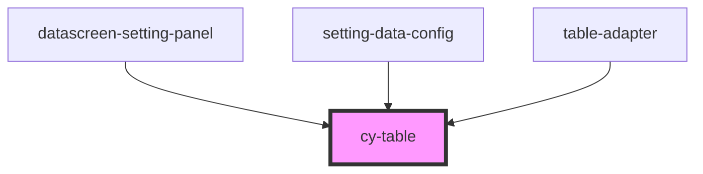

# cy-table

<!-- Auto Generated Below -->

## Properties

| Property     | Attribute | Description | Type          | Default                                                             |
| ------------ | --------- | ----------- | ------------- | ------------------------------------------------------------------- |
| `Columns`    | --        |             | `Column[]`    | `undefined`                                                         |
| `dataSource` | --        |             | `any[]`       | `undefined`                                                         |
| `option`     | --        |             | `TableOption` | `{         orderOption: {             show: false         },     }` |

## Dependencies

### Used by

 - [datascreen-setting-panel](../datascreen-setting-panel)
 - [setting-data-config](../setting-data-config)
 - [table-adapter](../../adapter/table-adapter)

### Graph

----------------------------------------------

*Built with [StencilJS](https://stenciljs.com/)*
