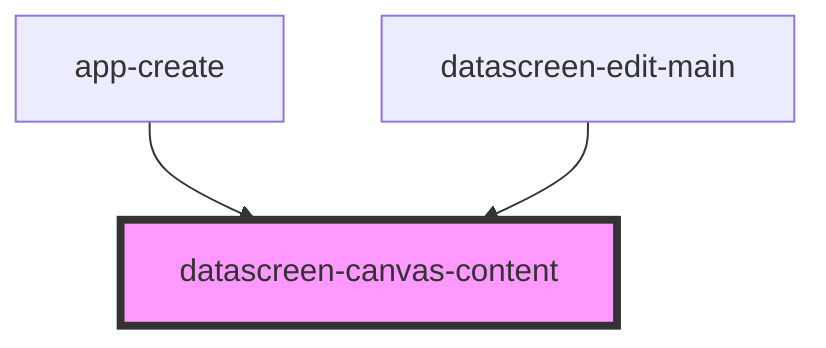

# datascreen-canvas-content

<!-- Auto Generated Below -->

## Properties

| Property         | Attribute           | Description | Type     | Default |
| ---------------- | ------------------- | ----------- | -------- | ------- |
| `maxCanvasSCale` | `max-canvas-s-cale` |             | `number` | `300`   |
| `minCanvasScale` | `min-canvas-scale`  |             | `number` | `15`    |
| `padding`        | `padding`           |             | `number` | `0`     |

## Events

| Event               | Description | Type               |
| ------------------- | ----------- | ------------------ |
| `canvasScaleChange` |             | `CustomEvent<any>` |

## Methods

### `resizeSCale() => Promise<void>`

#### Returns

Type: `Promise<void>`

## Dependencies

### Used by

 - [app-create](../app-create)
 - [datascreen-edit-main](../datascreen-edit-main)

### Graph

----------------------------------------------

*Built with [StencilJS](https://stenciljs.com/)*
