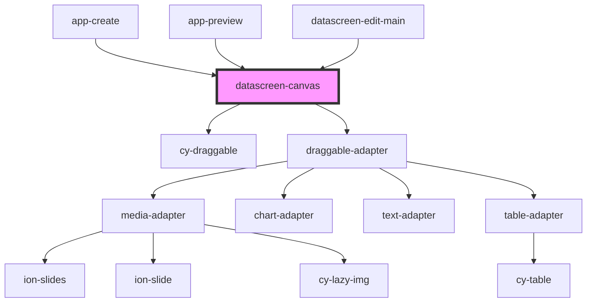

# datascreen-canvas

<!-- Auto Generated Below -->

## Properties

| Property    | Attribute    | Description | Type      | Default |
| ----------- | ------------ | ----------- | --------- | ------- |
| `canModify` | `can-modify` |             | `boolean` | `true`  |
| `scale`     | `scale`      |             | `number`  | `100.0` |

## Events

| Event          | Description | Type               |
| -------------- | ----------- | ------------------ |
| `canvasChange` |             | `CustomEvent<any>` |
| `popover`      |             | `CustomEvent<any>` |

## Methods

### `chooseComponent(comId: any) => Promise<void>`

#### Returns

Type: `Promise<void>`

### `getCanvasSize() => Promise<{ w: number; h: number; }>`

#### Returns

Type: `Promise<{ w: number; h: number; }>`

### `mapComDatasToState(comList: ComData[]) => Promise<void>`

#### Returns

Type: `Promise<void>`

### `updateCanvasConfig(config: CanvasConfig) => Promise<void>`

#### Returns

Type: `Promise<void>`

## Dependencies

### Used by

 - [app-create](../app-create)
 - [app-preview](../app-preview)
 - [datascreen-edit-main](../datascreen-edit-main)

### Depends on

- [cy-draggable](../cy-draggable)
- [draggable-adapter](../../adapter/draggable-adapter)

### Graph

----------------------------------------------

*Built with [StencilJS](https://stenciljs.com/)*
