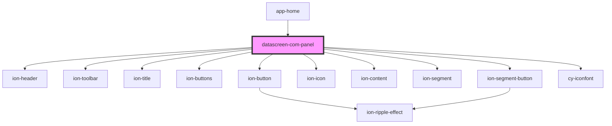

# datascreen-com-panel

<!-- Auto Generated Below -->

## Events

| Event       | Description | Type               |
| ----------- | ----------- | ------------------ |
| `checkMenu` |             | `CustomEvent<any>` |

## Dependencies

### Used by

 - [app-home](../app-home)

### Depends on

- ion-header
- ion-toolbar
- ion-title
- ion-buttons
- ion-button
- ion-icon
- ion-content
- ion-segment
- ion-segment-button
- [cy-iconfont](../cy-iconfont)

### Graph

----------------------------------------------

*Built with [StencilJS](https://stenciljs.com/)*
