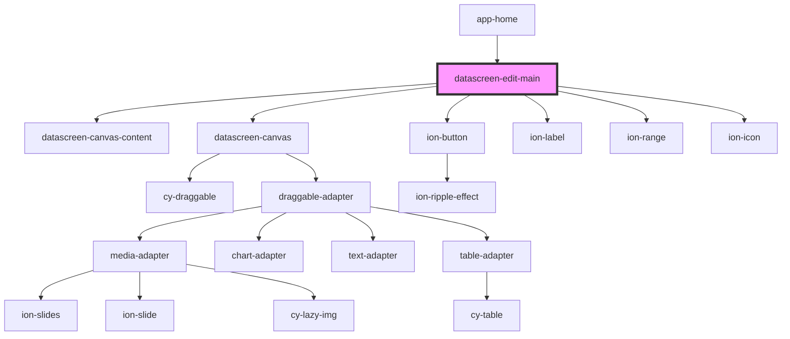

# datascreen-edit-main

<!-- Auto Generated Below -->

## Dependencies

### Used by

 - [app-home](../app-home)

### Depends on

- [datascreen-canvas-content](../datascreen-canvas-content)
- [datascreen-canvas](../datascreen-canvas)
- ion-button
- ion-label
- ion-range
- ion-icon

### Graph

----------------------------------------------

*Built with [StencilJS](https://stenciljs.com/)*
