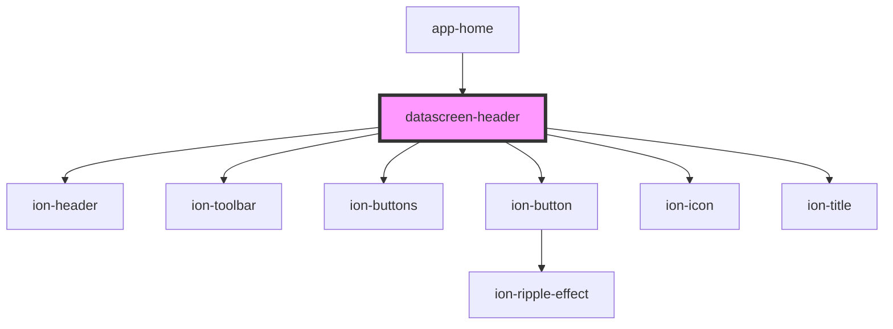

# datascreen-header

<!-- Auto Generated Below -->

## Properties

| Property           | Attribute        | Description | Type            | Default                 |
| ------------------ | ---------------- | ----------- | --------------- | ----------------------- |
| `checkMenuControl` | --               |             | `boolean[]`     | `[false, false, false]` |
| `dataScreenId`     | `data-screen-id` |             | `string`        | `undefined`             |
| `history`          | --               |             | `RouterHistory` | `undefined`             |

## Events

| Event       | Description | Type               |
| ----------- | ----------- | ------------------ |
| `checkMenu` |             | `CustomEvent<any>` |
| `popover`   |             | `CustomEvent<any>` |

## Dependencies

### Used by

 - [app-home](../app-home)

### Depends on

- ion-header
- ion-toolbar
- ion-buttons
- ion-button
- ion-icon
- ion-title

### Graph

----------------------------------------------

*Built with [StencilJS](https://stenciljs.com/)*
