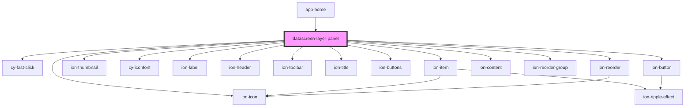

# datascreen-layer-panel

<!-- Auto Generated Below -->

## Events

| Event       | Description | Type               |
| ----------- | ----------- | ------------------ |
| `checkMenu` |             | `CustomEvent<any>` |

## Methods

### `chooseComponentById(comId: any) => Promise<void>`

#### Returns

Type: `Promise<void>`

### `mapComIdsToState(newComIdList: string[]) => Promise<void>`

#### Returns

Type: `Promise<void>`

## Dependencies

### Used by

 - [app-home](../app-home)

### Depends on

- [cy-fast-click](../cy-fast-click)
- ion-item
- ion-thumbnail
- [cy-iconfont](../cy-iconfont)
- ion-label
- ion-header
- ion-toolbar
- ion-title
- ion-buttons
- ion-button
- ion-icon
- ion-content
- ion-reorder-group
- ion-reorder

### Graph

----------------------------------------------

*Built with [StencilJS](https://stenciljs.com/)*
