# datascreen-setting-panel

<!-- Auto Generated Below -->

## Events

| Event   | Description | Type               |
| ------- | ----------- | ------------------ |
| `alert` |             | `CustomEvent<any>` |

## Methods

### `setComponentConfigData(comData: any) => Promise<void>`

#### Returns

Type: `Promise<void>`

## Dependencies

### Used by

 - [app-home](../app-home)

### Depends on

- ion-button
- [setting-canvas-option](../setting-canvas-option)
- ion-header
- ion-segment
- ion-segment-button
- ion-icon
- ion-toolbar
- ion-title
- ion-content
- [setting-common-config](../setting-common-config)
- ion-grid
- ion-row
- ion-col
- ion-input
- [cy-lazy-img](../cy-lazy-img)
- [cy-item-extend](../cy-item-extend)
- ion-toggle
- ion-select
- ion-select-option
- [cy-table](../cy-table)
- [setting-chart-series](../setting-chart-series)
- [setting-data-config](../setting-data-config)

### Graph

```mermaid
graph TD;
  datascreen-setting-panel --> ion-button
  datascreen-setting-panel --> setting-canvas-option
  datascreen-setting-panel --> ion-header
  datascreen-setting-panel --> ion-segment
  datascreen-setting-panel --> ion-segment-button
  datascreen-setting-panel --> ion-icon
  datascreen-setting-panel --> ion-toolbar
  datascreen-setting-panel --> ion-title
  datascreen-setting-panel --> ion-content
  datascreen-setting-panel --> setting-common-config
  datascreen-setting-panel --> ion-grid
  datascreen-setting-panel --> ion-row
  datascreen-setting-panel --> ion-col
  datascreen-setting-panel --> ion-input
  datascreen-setting-panel --> cy-lazy-img
  datascreen-setting-panel --> cy-item-extend
  datascreen-setting-panel --> ion-toggle
  datascreen-setting-panel --> ion-select
  datascreen-setting-panel --> ion-select-option
  datascreen-setting-panel --> cy-table
  datascreen-setting-panel --> setting-chart-series
  datascreen-setting-panel --> setting-data-config
  ion-button --> ion-ripple-effect
  setting-canvas-option --> ion-header
  setting-canvas-option --> ion-toolbar
  setting-canvas-option --> ion-title
  setting-canvas-option --> ion-content
  setting-canvas-option --> ion-grid
  setting-canvas-option --> ion-row
  setting-canvas-option --> ion-col
  setting-canvas-option --> ion-input
  setting-canvas-option --> ion-img
  setting-canvas-option --> ion-button
  ion-segment-button --> ion-ripple-effect
  setting-common-config --> ion-grid
  setting-common-config --> ion-row
  setting-common-config --> ion-col
  setting-common-config --> ion-input
  setting-common-config --> ion-range
  cy-item-extend --> ion-list
  cy-item-extend --> ion-item
  cy-item-extend --> ion-label
  cy-item-extend --> ion-icon
  cy-item-extend --> ion-item-group
  ion-item --> ion-icon
  ion-item --> ion-ripple-effect
  setting-chart-series --> ion-row
  setting-chart-series --> ion-col
  setting-chart-series --> ion-button
  setting-chart-series --> ion-segment
  setting-chart-series --> ion-segment-button
  setting-chart-series --> ion-label
  setting-chart-series --> ion-list
  setting-chart-series --> ion-input
  setting-chart-series --> cy-item-extend
  setting-chart-series --> ion-select
  setting-chart-series --> ion-select-option
  setting-chart-series --> ion-toggle
  setting-data-config --> ion-input
  setting-data-config --> ion-row
  setting-data-config --> ion-col
  setting-data-config --> ion-select
  setting-data-config --> ion-select-option
  setting-data-config --> cy-table
  setting-data-config --> ion-textarea
  setting-data-config --> ion-note
  setting-data-config --> cy-item-extend
  setting-data-config --> ion-toggle
  setting-data-config --> ion-button
  app-home --> datascreen-setting-panel
  style datascreen-setting-panel fill:#f9f,stroke:#333,stroke-width:4px
```

----------------------------------------------

*Built with [StencilJS](https://stenciljs.com/)*
