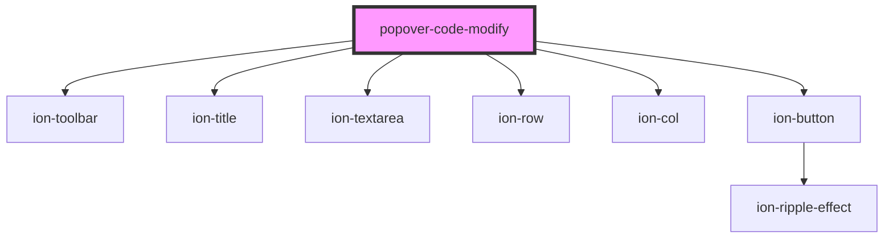

# popover-code-modify

<!-- Auto Generated Below -->

## Properties

| Property          | Attribute        | Description | Type       | Default     |
| ----------------- | ---------------- | ----------- | ---------- | ----------- |
| `dataScreenId`    | `data-screen-id` |             | `string`   | `undefined` |
| `dismissCallBack` | --               |             | `Function` | `undefined` |

## Events

| Event   | Description | Type               |
| ------- | ----------- | ------------------ |
| `toast` |             | `CustomEvent<any>` |

## Dependencies

### Depends on

- ion-toolbar
- ion-title
- ion-textarea
- ion-row
- ion-col
- ion-button

### Graph

----------------------------------------------

*Built with [StencilJS](https://stenciljs.com/)*
