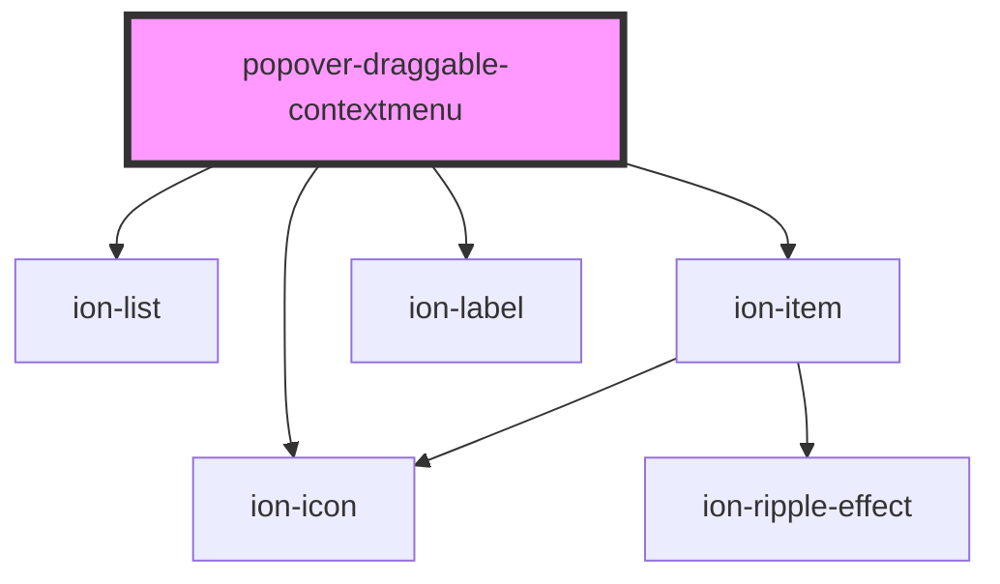

# popover-draggable-contextmenu

<!-- Auto Generated Below -->

## Properties

| Property | Attribute | Description | Type     | Default     |
| -------- | --------- | ----------- | -------- | ----------- |
| `comId`  | `com-id`  |             | `string` | `undefined` |

## Events

| Event   | Description | Type               |
| ------- | ----------- | ------------------ |
| `toast` |             | `CustomEvent<any>` |

## Dependencies

### Depends on

- ion-list
- ion-item
- ion-icon
- ion-label

### Graph

----------------------------------------------

*Built with [StencilJS](https://stenciljs.com/)*
