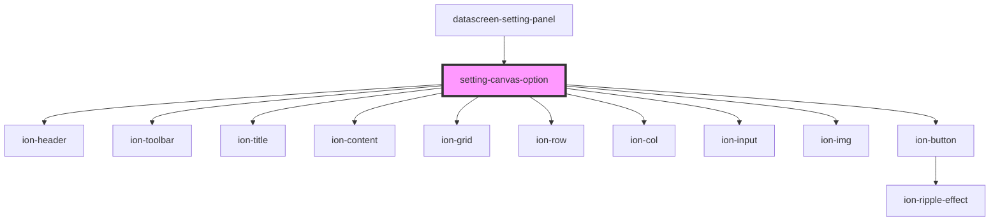

# setting-canvas-option

<!-- Auto Generated Below -->

## Events

| Event   | Description | Type               |
| ------- | ----------- | ------------------ |
| `toast` |             | `CustomEvent<any>` |

## Dependencies

### Used by

 - [datascreen-setting-panel](../datascreen-setting-panel)

### Depends on

- ion-header
- ion-toolbar
- ion-title
- ion-content
- ion-grid
- ion-row
- ion-col
- ion-input
- ion-img
- ion-button

### Graph

----------------------------------------------

*Built with [StencilJS](https://stenciljs.com/)*
