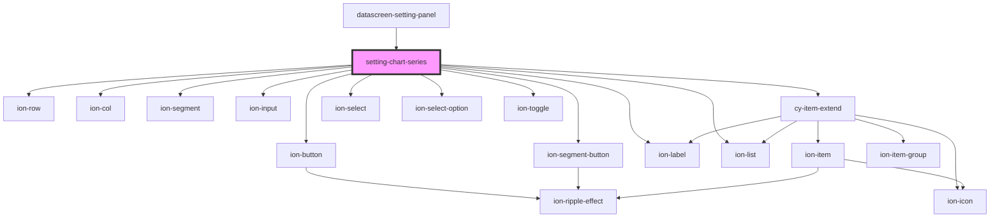

# setting-chart-series

<!-- Auto Generated Below -->

## Properties

| Property | Attribute | Description | Type    | Default     |
| -------- | --------- | ----------- | ------- | ----------- |
| `series` | --        |             | `any[]` | `undefined` |

## Events

| Event      | Description | Type               |
| ---------- | ----------- | ------------------ |
| `cyChange` |             | `CustomEvent<any>` |

## Dependencies

### Used by

 - [datascreen-setting-panel](../datascreen-setting-panel)

### Depends on

- ion-row
- ion-col
- ion-button
- ion-segment
- ion-segment-button
- ion-label
- ion-list
- ion-input
- [cy-item-extend](../cy-item-extend)
- ion-select
- ion-select-option
- ion-toggle

### Graph

----------------------------------------------

*Built with [StencilJS](https://stenciljs.com/)*
