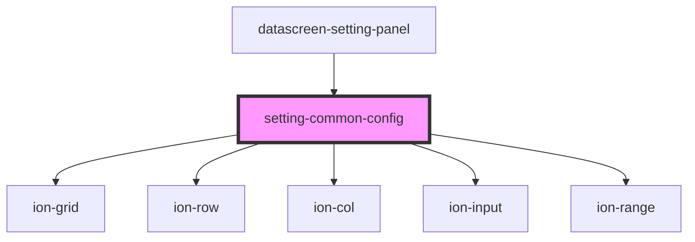

# setting-common-config

<!-- Auto Generated Below -->

## Properties

| Property  | Attribute | Description | Type            | Default     |
| --------- | --------- | ----------- | --------------- | ----------- |
| `comData` | --        |             | `DragComOption` | `undefined` |

## Events

| Event      | Description | Type               |
| ---------- | ----------- | ------------------ |
| `cyChange` |             | `CustomEvent<any>` |

## Dependencies

### Used by

 - [datascreen-setting-panel](../datascreen-setting-panel)

### Depends on

- ion-grid
- ion-row
- ion-col
- ion-input
- ion-range

### Graph

----------------------------------------------

*Built with [StencilJS](https://stenciljs.com/)*
