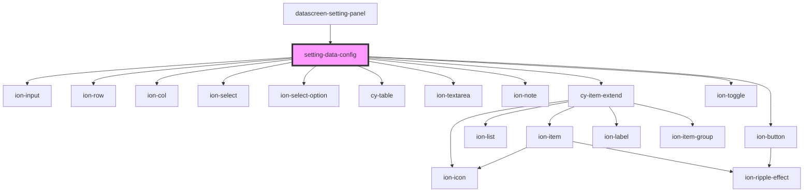

# setting-data-config

<!-- Auto Generated Below -->

## Properties

| Property         | Attribute | Description | Type               | Default     |
| ---------------- | --------- | ----------- | ------------------ | ----------- |
| `comDataApiData` | --        |             | `DraggableApiData` | `undefined` |
| `comId`          | `com-id`  |             | `string`           | `undefined` |

## Events

| Event      | Description | Type               |
| ---------- | ----------- | ------------------ |
| `cyChange` |             | `CustomEvent<any>` |
| `toast`    |             | `CustomEvent<any>` |

## Dependencies

### Used by

 - [datascreen-setting-panel](../datascreen-setting-panel)

### Depends on

- ion-input
- ion-row
- ion-col
- ion-select
- ion-select-option
- [cy-table](../cy-table)
- ion-textarea
- ion-note
- [cy-item-extend](../cy-item-extend)
- ion-toggle
- ion-button

### Graph

----------------------------------------------

*Built with [StencilJS](https://stenciljs.com/)*
